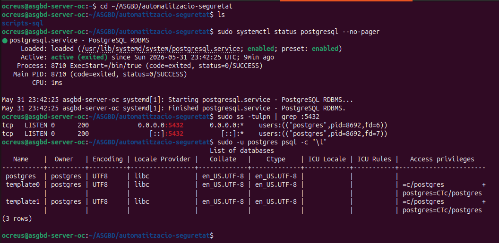
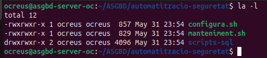
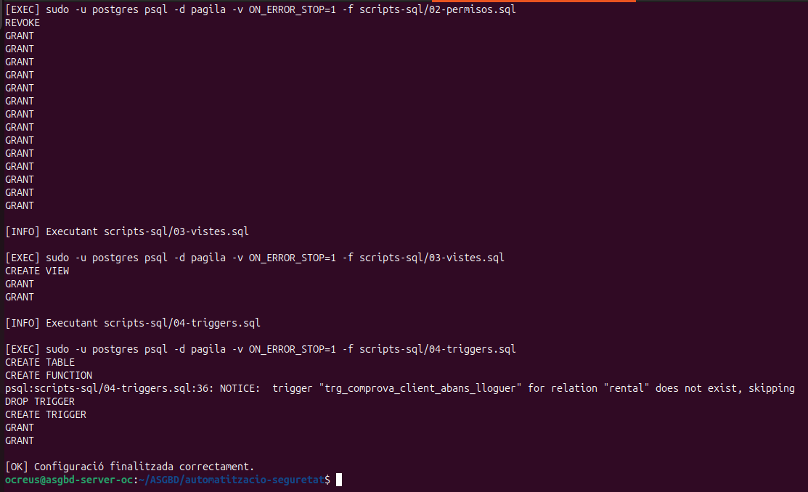
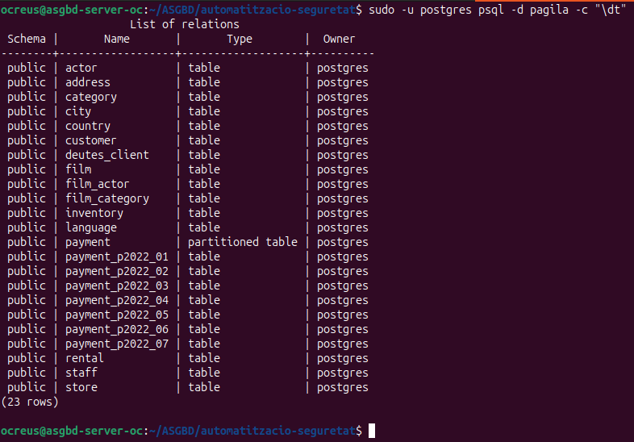
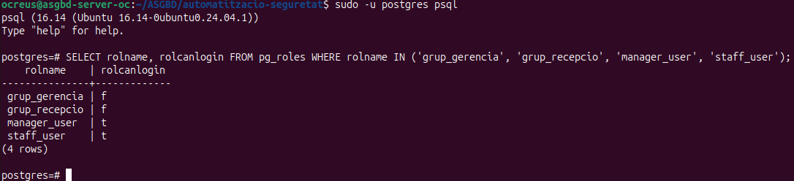
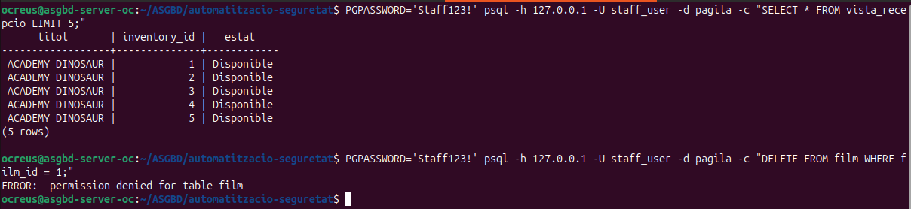
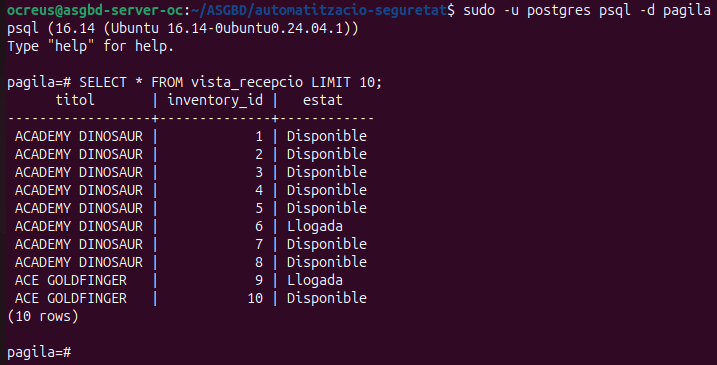
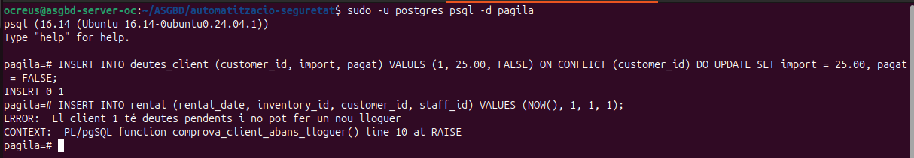
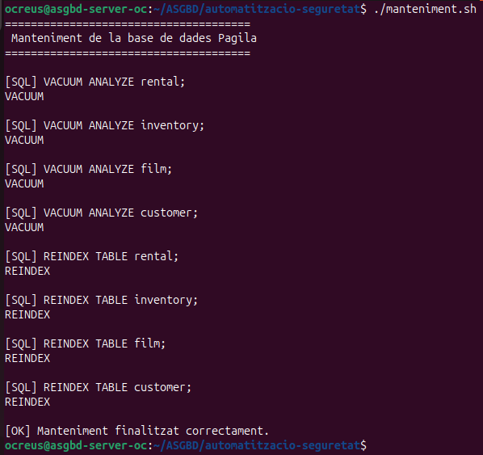
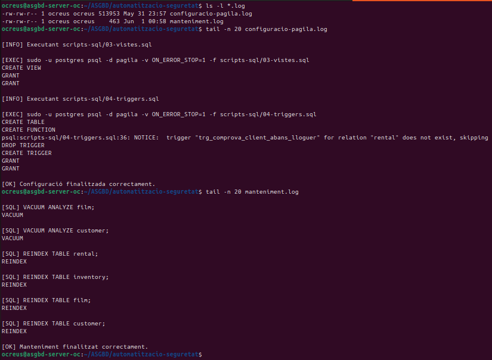

# Automatització i seguretat amb PostgreSQL i Pagila

## Objectiu de la pràctica

En aquesta pràctica he preparat una configuració automàtica de la base de dades Pagila amb PostgreSQL, el objectiu és no fer tots els passos manualment cada vegada, sinó tenir un script principal que prepari la base de dades, carregui Pagila, creï els rols, apliqui permisos, generi una vista i configuri un trigger, a més he creat un script de manteniment per executar operacions bàsiques com `VACUUM ANALYZE` i `REINDEX`, i he guardat el resultat dels scripts en fitxers de log.

## Preparació de l'entorn

He fet la pràctica a la màquina `asgbd-server-oc`, que és la màquina on tinc PostgreSQL instal·lat per treballar aquestes activitats, primer he comprovat que PostgreSQL estava funcionant i que el port `5432` estava escoltant correctament:

```bash
sudo systemctl status postgresql --no-pager
sudo ss -tulpn | grep :5432
```

També he comprovat que podia accedir a PostgreSQL amb l'usuari `postgres`:

```bash
sudo -u postgres psql -c "\l"
```



Aqui podem veure que PostgreSQL està actiu, que el port `5432` està escoltant i que puc consultar les bases de dades amb l'usuari `postgres`.

## Estructura de la pràctica

He creat la carpeta de la pràctica dins de `~/ASGBD/automatitzacio-seguretat`, el motiu es basicament és tenir-ho tot una mica ordenat, el script principal a la carpeta principal i els scripts SQL dins de `scripts-sql`.

L'estructura inicial la he comprovat amb:

```bash
ls -l
```



Podem veure els scripts principals creats i la carpeta `scripts-sql` i els scripts `configura.sh` i `manteniment.sh` els hi he donat permisos d'execució.

## Script principal `configura.sh`

El fitxer `configura.sh` és el script principal de la pràctica, aquest script fa les parts més importants, prepara la base de dades Pagila, executa els scripts SQL en ordre, guarda la sortida al fitxer `configuracio-pagila.log` i para l'execució si hi ha algun error important



Aqui es veu que el script ha executat els scripts SQL i ha acabat amb el missatge:

```text
[OK] Configuració finalitzada correctament.
```

Això vol dir que la part d'automatització no ha donat problemes.

## Preparació de Pagila

El primer script que s'executaré és:

```text
scripts-sql/00-prepara-pagila.sh
```

Aquest script prepara Pagila, el que fa és clonar el repositori, crear la base de dades `pagila` i carregar l'esquema i la informació, el contingut, després he comprovat que la base de dades s'havia carregat correctament amb:

```bash
sudo -u postgres psql -d pagila -c "\dt"
```



En aquesta captura es veuen les taules de Pagila i la taula `deutes_client`, que he creat perque funciones el trigger de la pràctica, ara veure que la base de dades `pagila` no està buida i que les taules s'han carregat bé.

## Creació de rols i usuaris

El fitxer encarregat de crear els rols i usuaris és:

```text
scripts-sql/01-rols.sql
```

He creat dos rols de grup:

```text
grup_gerencia
grup_recepcio
```

I dos usuaris:

```text
manager_user
staff_user
```

La idea és que els permisos no vagin directament a cada usuari, sinó als grups. Això és més ordenat, perquè després només cal posar cada usuari dins del grup que toca, per miaro he fet:

```sql
SELECT rolname, rolcanlogin
FROM pg_roles
WHERE rolname IN ('grup_gerencia', 'grup_recepcio', 'manager_user', 'staff_user');
```



Aqui es poden veure que els rols de grup no poden iniciar sessió, perquè només serveixen per agrupar permisos, pero, `manager_user` i `staff_user` sí que poden iniciar sessió.

## Permisos aplicats

El fitxer dels permisos és:

```text
scripts-sql/02-permisos.sql
```

Aquí he donat permisos diferents segons el tipus d'usuari, el grup de gerència té més permisos, perquè pot consultar i modificar algunes taules importants, el grup de recepció té permisos més limitats. Pot consultar informació i treballar amb algunes dades, però no pot fer qualsevol cosa y per comprovar-ho he provat amb l'usuari `staff_user` amb una consulta a la vista de recepció:

```bash
PGPASSWORD='Staff123!' psql -h 127.0.0.1 -U staff_user -d pagila -c "SELECT * FROM vista_recepcio LIMIT 5;"
```

Després he provat una petició que no hauria de poder fer, com borrar dades de la taula `film`:

```bash
PGPASSWORD='Staff123!' psql -h 127.0.0.1 -U staff_user -d pagila -c "DELETE FROM film WHERE film_id = 1;"
```



En aquesta captura es veu que `staff_user` pot consultar la vista, però no pot fer un `DELETE` a la taula `film`, aixo esta bé perquè vol dir que l'usuari de recepció no té permisos totals sobre la base de dades.

## Vista per recepció

El fitxer que crea la vista és:

```text
scripts-sql/03-vistes.sql
```

He creat una vista que es diu:

```text
vista_recepcio
```

Aquesta vista mostra informació útil per recepció, com el títol de la pel·lícula, l'identificador de l'inventari i si està disponible o llogada i per veure que fucionaba:

```sql
SELECT * FROM vista_recepcio LIMIT 10;
```



Podem comprobar que la vista funciona i mostra dades de les pel·lícules amb el seu estat.

## Trigger de control de lloguers

El fitxer del trigger és:

```text
scripts-sql/04-triggers.sql
```

Aquí he creat una taula anomenada `deutes_client` i un trigger que comprova si un client té deutes pendents abans de fer un nou lloguer el objectiu és que si un client té un deute pendent, no hauria de poder fer un nou lloguer.

Primer he afegit un deute a un client:

```sql
INSERT INTO deutes_client (customer_id, import, pagat)
VALUES (1, 25.00, FALSE)
ON CONFLICT (customer_id)
DO UPDATE SET import = 25.00, pagat = FALSE;
```

Després he intentat crear un lloguer amb aquest client:

```sql
INSERT INTO rental (rental_date, inventory_id, customer_id, staff_id)
VALUES (NOW(), 1, 1, 1);
```



En aquesta captura es veu que el trigger bloqueja el lloguer i mostra un error dient que el client té deutes pendents i el error és el lo que buscava, basicament, el trigger està fent la seva feina.

## Script de manteniment

També he creat el fitxer:

```text
manteniment.sh
```

Aquest script serveix per fer tasques bàsiques de manteniment sobre algunes taules importants de Pagila.

Executa operacions com:

```sql
VACUUM ANALYZE rental;
VACUUM ANALYZE inventory;
VACUUM ANALYZE film;
VACUUM ANALYZE customer;
```

I també:

```sql
REINDEX TABLE rental;
REINDEX TABLE inventory;
REINDEX TABLE film;
REINDEX TABLE customer;
```



Aqui es veu que el script ha executat els `VACUUM ANALYZE` i els `REINDEX` correctament, aixi es poden actualitzar estadístiques

## Logs generats

Un altre punt important de la pràctica era guardar el resultat dels scripts en logs.

Els fitxers generats són:

```text
configuracio-pagila.log
manteniment.log
```

Ho he comprovat amb:

```bash
ls -l *.log
```

I després he mirat el final dels logs:

```bash
tail -n 10 configuracio-pagila.log
tail -n 10 manteniment.log
```



Aqui podem comprobar que existeixen els dos logs i que al final apareixen els missatges que tothom busca:

```text
[OK] Configuració finalitzada correctament.
[OK] Manteniment finalitzat correctament.
```

També apareix un avís del trigger:

```text
NOTICE: trigger "trg_comprova_client_abans_lloguer" for relation "rental" does not exist, skipping
```

Això no és un error, es que el script intenta esborrar el trigger abans de crear-lo i com que era la primera vegada que s'executava, encara no existia, després el trigger es crea perfecte.
